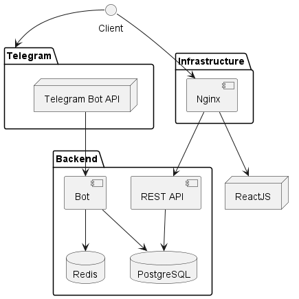

# Preparing the Development Environment



This is a system architecture diagram illustrating the components and interactions of a software application setup. 
In this configuration you can test the project on your local machine.

!!! question "How is the development mode implemented?"
    - Here, the client (your browser) is making requests to the ngrok service, which in turn routes the requests to the frontend ReactJS application.
    - Also, your browser is making requests to the REST API directly, to the localhost.
    - In this case the React is to be run with command `npm run dev --host` to accept requests from the ngrok service.

The following is the list of actions you need to take to set up the development environment:

## 1. Ngrok sign up
If you haven't done this already, read [Ngrok setup section](ngrok.md) to set up a static domain and auth-token on Ngrok.

## 2. Ngrok Configuration

1. Rename the file `ngrok.yml.dist` to `ngrok.yml`.

2. In `ngrok.yml`, update the content as:
    ```yaml hl_lines="2 9" title="ngrok.yml"
    version: 2
    authtoken: <your-ngrok-token>
    tunnels:
   
      # frontend
      first:
        addr: app:5173
        proto: http
        hostname: your-ngrok-hostname.ngrok-free.app
    ```
3. Replace `<your-ngrok-token>` with the token from your Ngrok account.

4. Adjust the `your-ngrok-hostname.ngrok-free.app` with the static domain you set up in Ngrok (refer to the [Ngrok setup section](ngrok.md) for more details).

## 3. Modify the `docker-compose.yml` file

1. Uncomment the Ngrok service in `docker-compose.yml`.)
2. Uncomment the line in the `docker-compose.yml` in the `app` service to run the following command: `command: ["npm", "run", "dev", "--host"]`
3. Comment the line in the `docker-compose.yml` in the `app` service to run the following command: `command: ["npm", "run", "build"]`


```yaml hl_lines="13 16 23-31" title="docker-compose.yml"
version: "3"

services:
  app:
    build:
        context: ./frontend
        dockerfile: Dockerfile
    working_dir: "/home/node/app"
    volumes:
      - /var/app/medsync/:/home/node/app/dist

    # Uncomment this if you are running in development
#    command: ["npm", "run", "dev", "--host"]

    # Comment this if you are running in production
    command: ["npm", "run", "build"]

    stop_signal: SIGINT
    
#    ...
#    other services

#  ngrok:
#    image: ngrok/ngrok:latest
#    restart: unless-stopped
#    environment:
#      - NGROK_CONFIG=/etc/ngrok.yml
#    volumes:
#      - ./ngrok.yml:/etc/ngrok.yml
#    expose:
#      - 443

volumes:
  pgdata: { }
  cache: { }

```

## 4. Change the `frontend/.env` file
Again, if not done already in the [Configuration section](configuration.md), change the `frontend/.env` file to:
```dotenv title="frontend/.env"
VITE_REACT_APP_API_URL=http://localhost:3779
```

This will allow the React application to make requests to the REST API directly, to the localhost.


!!! danger
    You may encounter a problem when downloading the Test results from the bot. This is due to the fact that the `public`
    directory is built by the React App. To fix this, you can run once set up the `npm run build` command in the `app` service, 
    and then comment it out again. This will build the `public` directory and the bot will be able to download the Test results.