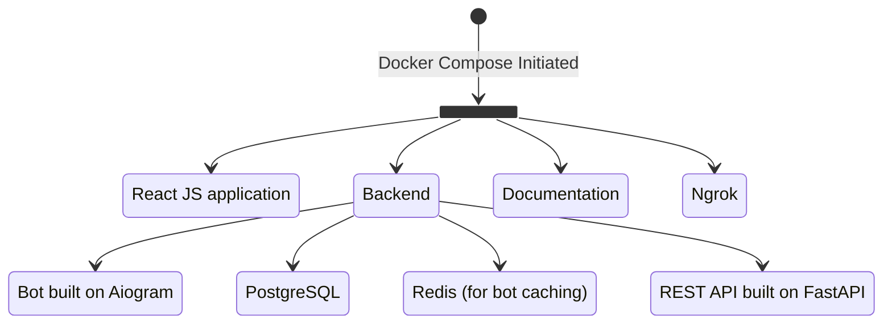

# MedSync WebApp Documentation

## Introduction

Welcome to the MedSync WebApp documentation. This app serves as an efficient bridge between patients and healthcare
professionals, providing streamlined access to medical services via the Telegram platform.

!!! warning
    The MedSync WebApp is for demonstration purposes only and not intended for actual medical services.

[Link to Bot in Telegram](https://t.me/MedSyncbot)

**Key Features:**

- Swift booking of appointments with medical specialists or diagnostics tests like MRI.
- An intuitive interface to search, select, and interact with healthcare experts, diagnostic types, and clinics
- Integration with Telegram for seamless user experience.

!!! example "Showcase"

    You can try out the MedSync WebApp:

    - Initiate the [MedSync bot on Telegram](https://t.me/MedSyncbot).
    - Otherwise, you can see the [Userflow page](userflow.md) for a quick overview of the MedSync WebApp.

## System Requirements and Setup

!!! note
    This guide focuses on setting up on Windows/MacOS/Linux.

#### Software and OS:

- **Docker & Docker-Compose (1)**
    { .annotate }

    1.  Required to containerize and orchestrate the application services. Compatible with
   Windows, MacOS, and Linux. 

#### Hosting and Domain:

- **Server with Domain Ownership and SSL-Certificate (1)**
    { .annotate }

    1.  If you're deploying this project live, you'll need a server and an owned domain. For
    securing your domain, an SSL certificate is mandatory. You can obtain one, for instance, using Let's Encrypt's
    Certbot.

#### Local Testing (Optional):

- **Ngrok**: If you opt to run the project locally and still want external access, you can use Ngrok. This will require
  creating an account with Ngrok, setting up a static domain (free tier), and noting down the domain for later use.
  Detailed instructions for Ngrok setup can be found on [a dedicated page](ngrok.md).

### Project Composition:

Once the Docker processes are initiated, it will orchestrate the entire project setup:

- **Frontend**: A React JS application.
- **Backend**: Comprises multiple components:
    - **Bot**: Built on the [aiogram framework](https://docs.aiogram.dev/en/latest/).
    - **Database**: [PostgreSQL](https://www.postgresql.org/) for structured data storage.
    - **Caching**: [Redis](https://redis.io/) is utilized for caching purposes within the bot.
    - **REST API**: Developed using [FastAPI](https://fastapi.tiangolo.com/) with [SQLAlchemy](https://www.sqlalchemy.org/) for ORM,
  and [Alembic](https://alembic.sqlalchemy.org/en/latest/) for database migrations.
- **Documentation Image (Optional)**: While there's an image dedicated for documentation, it is commented out by default
  in the Docker configuration. Build with [Material for MkDocs](https://squidfunk.github.io/mkdocs-material/).
- **Ngrok (Optional)**: There's also a [Ngrok](https://ngrok.com/) configuration, but it's commented out by default.

---

## Project Setup

### Configuration

!!! info
    Setting up the MedSync Bot requires configuring certain environment variables and adjusting specific settings to match
    your intended deployment environment.

**[Configuration Guidelines](configuration.md)**: This section provides a detailed walkthrough on how to adjust the
essential configurations for the MedSync Bot. Ensure you've set these up before deploying.

Once you've followed through with the configuration steps, you can then move forward with the deployment process.

### Initializing Dependencies

Before diving into the core setup, it's pivotal to ensure all dependencies and related tools are in place and configured
correctly. Initializing dependencies is a foundational step that preempts the rest of the setup process, ensuring that
everything is in place for the MedSync WebApp to function correctly.

**[Dependency Initialization Guidelines](dependencies-initialization.md)**: This guide details the steps to ensure all
software, libraries, and tools are correctly installed and initialized. Adhering to these guidelines will aid in
preventing potential issues during the setup and running of the MedSync WebApp.

It's advisable to review and complete the dependency initialization before proceeding further into the setup.

---

## Quick Overview

!!! question
    Wondering what functionalities MedSync offers? Here's a brief outline to get you started.

MedSync offers a series of functionalities aimed at enhancing patient-doctor interaction. Here's a brief outline:

- **Doctor Selection**: Search and choose from a list of medical experts based on specialization.
- **Appointment Booking**: Pick a convenient date and time slot.
- **Medical Tests**: Browse through various medical tests, learn about them, and book as needed.
- **Theme Adaptability**: The web app interface dynamically adapts to your current Telegram theme colors, ensuring a cohesive visual experience.
!!! example 
    If you have set a dark theme on Telegram, the MedSync WebApp interface will adapt to show dark mode elements, aligning with your preferred visual settings.

---

## Acknowledgements

This project is a submission for a [Telegram contest](https://t.me/contest/327). 

In order to create this documentation we've taken inspiration and borrowed some code blocks under the MIT
license from the [aiogram-3-guide](https://github.com/MasterGroosha/aiogram-3-guide) repository.

## License & Attribution

MedSync operates under the [MIT License](#). We've utilized various third-party libraries to enhance functionality, and
full attribution can be found [here](#).

## Contributors

MedSync's success is attributed to its dedicated team of developers, a UX/UI designer, and AI agents.

