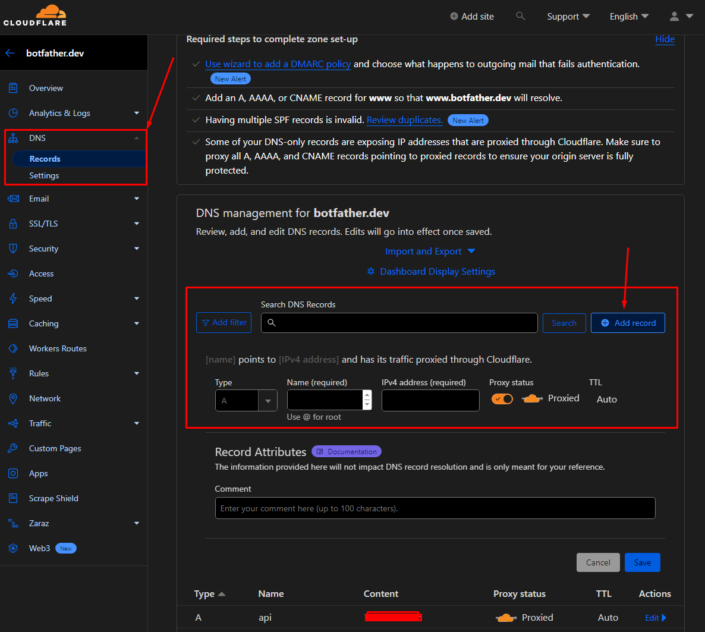

# Acquiring a Web Domain and Creating an A-record

!!! warning "OPTIONAL"
    If you're using Ngrok for testing purposes, you can skip this section.

!!! info "What is this section about?"
    For experienced developers who are familiar with domain operations, this section provides a general overview of how to
    acquire a web domain and set up an A-record pointing to your server. 
    
    This guide serves as an example to get you started.

## **1. Choosing a Domain Registrar**

!!! info "What is a Domain Registrar?"
    A domain registrar is a company that manages the reservation of internet domain names. There are numerous domain
      registrars available, including Namecheap, Google Domains, and many others.

Choose a registrar based on your preference, budget, and the features they offer.

## **2. Acquiring a Domain**

- Navigate to your chosen domain registrar's website.
- Use their search functionality to check the availability of your desired domain name.
- Once you've found an available domain, follow the purchase process. 

## **3. Pointing the Domain to Your Server (Creating an A-record)**

- After acquiring your domain, you'll need to point it to your server using an A-record. An A-record maps a domain
  name to an IP address.
- Log in to your domain registrar's dashboard.
- Navigate to the DNS management section. The location and naming of this section can vary, but it's often labeled
  as "DNS Settings," "Name Server Management," or something similar.
- Look for an option to add or manage records.

!!! danger 
    Not all domain registrars allow you to set up A-records. If you can't find the option to add or manage records, you 
    can set up the A-record using a third-party DNS provider like Cloudflare.

- Add a new A-record:
    - **Host/Name**: Often, you'll set this to `@` to represent the root domain. If you're setting up a subdomain,
      you'd enter the subdomain name.
    - **Value/Points to**: Enter the `IP address` of your server.
    - **TTL**: This is the time-to-live, indicating how long the DNS resolver should cache the query. You can
      usually leave this at the default setting.

- **Propagation**:

    - After setting the A-record, there's a propagation time. This is the time it takes for DNS changes to be updated
      across the internet. Depending on various factors, this can take anywhere from a few minutes to 48 hours.
    - You can use tools like [DNS Checker](https://www.dnschecker.org/) to check the propagation status.

!!! success
    With your domain name acquired and A-record set, you're now ready to proceed with Nginx and SSL certificate setup. 

