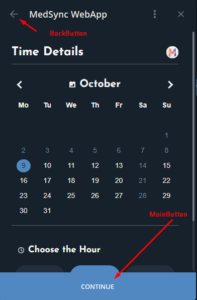

# Telegram WebApp Integration Features in MedSync

!!! abstract "Overview" 
    Understanding how MedSync seamlessly integrates with Telegram is pivotal for both developers and users. 

    By ensuring a cohesive experience, users can enjoy the capabilities of MedSync without ever feeling that they've departed from the familiar Telegram interface. 
    This guide provides a detailed overview of the features and integrations MedSync leverages from Telegram.


## 1. Dynamic Theming with SCSS Variables

!!! info 
    Dynamic theming allows a web application to adjust its appearance according to user preferences or system settings, leading to improved user experience and interface consistency. 

    MedSync leverages this by integrating **[Telegram theme parameters](https://core.telegram.org/bots/webapps#themeparams)** to adjust the interface based on the Telegram user's current theme. 

### Understanding the Theme Parameters

The Telegram Mini Apps can fetch the user's theme settings. These settings, formatted in CSS custom properties (`var(--property-name)`), can be directly accessed and applied within our SCSS. 

For instance, `var(--tg-theme-bg-color)` fetches the background color from the Telegram theme settings.

---

### Utilizing SCSS

In our project we have a `_vars.scss` file, that centralizes all the color and style variables, providing easy access and modification capabilities.

To integrate the Telegram theme parameters, we've used the following syntax (you can still use `var(--property-name)`, but we wanted to have all scss variables in a separate file): 

```scss title="src/scss/_vars.scss" 
    
$tg-theme-bg : var(--tg-theme-bg-color);
$tg-theme-secondary-bg: var(--tg-theme-secondary-bg-color);

$tg-theme-text: var(--tg-theme-text-color);
$tg-theme-hint: var(--tg-theme-hint-color);

$tg-theme-button: var(--tg-theme-button-color);
$tg-theme-button-text: var(--tg-theme-button-text-color);

$color-box-shadow: var(--tg-theme-secondary-bg-color);
```

### How to Apply theme colors

| Element                                      | Variable                        | Comment                                                                                       |
|----------------------------------------------|---------------------------------|-----------------------------------------------------------------------------------------------|
| Main Background                              | `--tg-theme-bg-color`           | The primary background color of the application.                                              |
| Elements Background                          | `--tg-theme-secondary-bg-color` | Use for components like cards or modals to contrast with the main background.                 |
| Text                                         | `--tg-theme-text-color`         | Standard text color for most website content.                                                 |
| Headers & Titles                             | `--tg-theme-text-color`         | Distinct color for main headings, using the primary text color for uniformity.                |
| Subheaders                                   | `--tg-theme-hint-color`         | A slightly subdued color, ideal for subheadings or secondary titles.                          |
| Borders & Dividers                           | `--tg-theme-secondary-bg-color` | Suitable for differentiating sections or separating items in a list.                          |
| Hints & Inactive Text & Placeholders & Icons | `--tg-theme-hint-color`         | Perfect for secondary information, tooltips, or less prominent icons.                         |
| Buttons (Background)                         | `--tg-theme-button-color`       | A contrasting color to ensure buttons stand out and are easily clickable.                     |
| Buttons (Text)                               | `--tg-theme-button-text-color`  | Provides an optimal contrast against the button's background color.                           |
| Links                                        | `--tg-theme-link-color`         | Clearly distinguishes hyperlinks from standard text.                                          |


Use this link to read more about [Telegram theme parameters](https://core.telegram.org/bots/webapps#themeparams).

!!! example "Practical Application"

    The `.search-bar` class showcases how these variables are applied in practice:

    - The input field’s border and background colors use the `$tg-theme-secondary-bg` variable, effectively adapting to the Telegram theme.
    - The text color for the input adapt based on the `$tg-theme-text` variable.
    - The placeholder text color is set to `$tg-theme-hint` to provide a subtle contrast with the input text.
  
```scss title="src/scss/blocks/_search-bar.scss" hl_lines="3-5 10 16"
.search-bar {
  &__input {
    border: 1px solid $tg-theme-secondary-bg;
    background: $tg-theme-secondary-bg;
    color: $tg-theme-text;
    
    //... other styles    
    
    input::placeholder {
      color: $tg-theme-hint;
    }
  }
  // ... other styles
  &__icon {
    &__img {
      stroke: $tg-theme-text;
    }
  }
}
```

---

## 2. Haptic Feedback

!!! info
    Haptic feedback is the use of touch sensations, like vibrations, to convey information or specific events within an application. It's an essential aspect of user experience, adding depth and tactile responses to user actions.

### Integration

Telegram provides developers with a set of haptic feedback methods to enrich user interactions. These methods can produce different touch sensations based on the specific events in the application.

Refer to [Telegram's documentation](https://core.telegram.org/bots/webapps#hapticfeedback) for more details on the available methods.

- `impactOccurred(style)`: Triggers when a collision or impact event happens within the UI. The style parameter dictates the strength and type of haptic feedback.
- `notificationOccurred(type)`: Indicates the completion, failure, or warning of an action. The type parameter specifies the kind of feedback.
- `selectionChanged()`: Activates when the user alters a selection. It is used to denote a change but not the actual selection or confirmation of an item.

### Haptic Feedback in MedSync

#### Using in React

In our React app we used a special hook from the library `"@vkruglikov/react-telegram-web-app`

```js
import {useHapticFeedback} from "@vkruglikov/react-telegram-web-app";

// ...

const [impactOccurred, notificationOccurred, selectionChanged] = useHapticFeedback();

// just call the function when you need it
selectionChanged()
```

#### Examples

Here's how we've strategically employed haptic feedback within MedSync:

- **Initial Selection**: When a user first chooses an option, like picking a doctor or medical specialty, we use `notificationOccurred("success")`. This provides a gentle confirmation to the user, assuring them of their successful selection.

- **Modification of Selection**: In cases where users already have a selection and decide to change or remove it, the method `selectionChanged()` is triggered. This delivers a subtle sensation indicating that a prior choice has been altered.

- **Primary Action Confirmation**: Upon pressing the main action button, `notificationOccurred` is invoked, offering a tactile affirmation of the action.

!!! tip "The sensations resulting from these methods"

    - `selectionChanged()`: Provides a soft, subtle pulse, indicating a change or shift.
    - `notificationOccurred("success")`: This feels more pronounced, marking the importance or culmination of a series of actions.

---

## 3. CloudStorage

!!! info 
    Telegram's **CloudStorage** feature acts as an agile solution to manage user data securely and efficiently, directly from the Telegram interface.

    MedSync employs this feature to store and retrieve essential user information, such as selected doctors, diagnostic details, and clinic locations.

### Telegram's CloudStorage Features

[Telegram's CloudStorage](https://core.telegram.org/bots/webapps#cloudstorage) provides a set of methods for developers to store and access data:

- `setItem`: Allows the storage of a value against a specific key.
- `getItem`: Retrieves a value using the provided key.
- `getItems`: Fetches multiple values using an array of keys.
- `removeItem`: Deletes a specific value using its key.
- `removeItems`: Removes multiple values using their respective keys.
- `getKeys`: Obtains a list of all keys stored in the cloud storage.

Each of these methods offers developers flexibility in how they manage and interact with user data.

### Implementation in MedSync

A Finite State Machine (FSM) is a computational model that operates based on a current state. 
It can change from one state to another in response to external inputs. We use `cloudStorage` essentially as a storage for our FSM.

!!! tip
    You can use it also for storing the actual `states` of your users! Therefore, they can continue from where they left off, even if they close the web app.

#### Using in React

In our React app we used a special hook from the library `"@vkruglikov/react-telegram-web-app`

```js
import {useCloudStorage} from "@vkruglikov/react-telegram-web-app";
// ...

const storage = useCloudStorage()
// ...
await storage.setItem("selectedTimeSlot", JSON.stringify(selectedTimeSlot))

```

#### Examples

For instance, when a user selects a specific time slot for an appointment, it's stored using:

```javascript
await storage.setItem("selectedTimeSlot", JSON.stringify(selectedTimeSlot));
```

Similarly, when users provide data in an input form, it's saved like so:

```javascript
await storage.setItem('user_data', JSON.stringify(formData));
```

!!! tip Saving Form Data
    This is particularly useful when users are required to fill out a form with multiple fields. 
    
    Once we save this, we can pre-fill the form with the saved data when the user returns to the page next time, or even if they close the web app and open it again.

To retrieve this information, we use:

```javascript
let savedUserData = JSON.parse(await storage.getItem('user_data'));
```

Note the use of `JSON.stringify` and `JSON.parse` methods, which convert JavaScript objects to strings and vice versa. This ensures the correct format for storage and subsequent retrieval.

Note, that you're not restricted by the JSON format, it's just a convenient way to store data in a string format.

!!! warning "Storage Limitations"
    Keep in mind that there are constraints to using Telegram's CloudStorage. 
    A bot can store up to 1024 items per user, with each key containing 1-128 characters, and values being 0-4096 characters long.

Now, when the user has finished with the form, we can remove the data from the storage:

```javascript
await storage.removeItem('user_data');
```

---

## 4. Navigation with Telegram's Buttons

!!! info 
    Telegram provides specialized objects, **BackButton** and **MainButton**, to ensure user navigation within the Mini App environment is intuitive and seamless.

### Understanding Button Objects



[Telegram's Button features](https://core.telegram.org/bots/webapps#buttons) are designed to integrate natively into the Telegram Mini App interface:

- **BackButton**: Controls the back button displayed in the header, enabling users to return to previous pages.
- **MainButton**: Controls the primary action button, displayed at the bottom. It's used to confirm actions or proceed to the next step.

Each of these button objects offers methods to customize their appearance, set event handlers, and manage their visibility and activity state.

### BackButton in MedSync

#### Using in React

```javascript
import {BackButton} from "@vkruglikov/react-telegram-web-app";
// ...

const SlotSelection = ({storageKey, itemType}) => {
    const navigate = useNavigate();
    ...
    return ( <>
        <BackButton onClick={() => navigate(-1)}/>
        ...
    </>)
}
```

!!! warning 
    There are scenarios where back navigation might be restricted to prevent users from reverting essential or irreversible actions. 

    For instance, after a successful booking, we may opt to hide the `BackButton` to prevent users from navigating back and altering confirmed details.

### MainButton in MedSync

#### Using in React

```javascript
import {MainButton} from "@vkruglikov/react-telegram-web-app";
// ...

const SlotSelection = ({storageKey, itemType}) => {
    const navigate = useNavigate()
    // ...
    
    const handleNext = async () => {
        notificationOccurred("success");
        // ...
        navigate(`/booking/patient-info-form/${itemType}`);
    };

    
    return (<>
        ...
        {selectedTimeSlot && (
            <MainButton onClick={handleNext}></MainButton>
        )}
    </>)
}
```

In the above example, the `MainButton` is only displayed when a time slot is selected, ensuring users can't proceed without making a selection. 
The button press triggers the `handleNext` function, which confirms the user's choice and navigates them to the next step.


---

## 5. Other WebApp Methods

!!! info 
    While external libraries offer a comfortable integration with the Telegram WebApp environment, 
    there's no shame in directly tapping the Telegram's native WebApp methods. 

    These methods grant developers robust control over the Mini App's behavior, user interactions, and appearance.

### Direct Usage

[Telegram's WebApp methods](https://core.telegram.org/bots/webapps#initializing-mini-apps) give developers direct 
control over the app's appearance, behavior, and interaction within the Telegram interface: from controlling the app's 
header and background color, managing its expanded state, to showing pop-ups and reading clipboard contents.

#### **Forced Expanded View**

One of the very first things MedSync ensures upon opening is the full utilization of the available screen space. We achieve this by forcing the Mini App into its expanded view. 

```javascript
const App = () => {
    useEffect(() => {
        if (window.Telegram && window.Telegram.WebApp) {
            window.Telegram.WebApp.expand();
        }
    }, []);
}
```

#### **Enhanced Closing Control**

To prevent users from unintentionally exiting the Mini App, especially when they're midway through making selections 
or providing essential information, MedSync activates the closing confirmation. 

This ensures that even if users make the slide-down gesture (typically used to close apps), they are prompted for confirmation.

```javascript
window.Telegram.WebApp.enableClosingConfirmation();
```

#### **Forced App Closure**

There might be instances when it's necessary to programmatically close the Mini App. 
This might be after a particular action has been confirmed, or some critical error has occurred. 

You can programmatically trigger the app to close using:

```javascript
window.Telegram.WebApp.close();
```

#### **Additional Integration Possibilities**

While MedSync has used specific WebApp methods as per its requirements, the Telegram WebApp provides a plethora of other functionalities. Developers can show alerts, confirmations, scan QR codes, request user contacts, and so much more.

!!! tip
    It's always a good practice to first check the availability of the `window.Telegram.WebApp` object before making any calls to ensure compatibility and avoid potential errors.

---

## 6. Securing User Data: Validating InitData

### Understanding `InitData`

In Telegram's WebApp environment, `InitData` is a secure way of receiving initial data about the user. 
This data can include the user's ID, their first and last name, and more. 

Most importantly, `InitData` contains a hashed string that can be validated against the information provided, ensuring its genuineness.

### Integrating in MedSync

#### Fetching `InitData` in React

To ensure we're working with the correct `InitData`, we utilize the `useInitData` hook:

```javascript
import {useInitData} from "@vkruglikov/react-telegram-web-app";

const [InitDataUnsafe, InitData] = useInitData();
```

When sending data to our backend, we include this `InitData`:

```javascript
const response = await axios.post(`${import.meta.env.VITE_REACT_APP_API_URL}/api/${itemType}/book_slot`, {
    // ... other data ...
    userInitData: InitData,
});
```

#### Backend Validation:

Once received in our backend, we validate the `InitData` using our bot's token.

```python
@diagnostics_router.post("/book_slot")
async def book_slot(request: Request, repo: RequestsRepo = Depends(get_repo)):
    data = await request.json()

    init_data = data.get("initData")
    if init_data and not validate_telegram_data(init_data):
        raise HTTPException(status_code=400, detail="Invalid initData")
    
    # ... rest of the method ...
```

The heart of the validation process is the `validate_telegram_data` function:

!!! example
    See full code in [utils.py](https://github.com/Latand/MedSyncWebApp/blob/main/backend/src/medsyncapp/webhook/utils.py)

```python
def validate_telegram_data(init_data: str) -> bool:
    # ... parsing and constructing data-check-string ...
    
    # Computing the secret key
    secret_key = hmac.new(b"WebAppData", config.tg_bot.token.encode(), hashlib.sha256).digest()
    
    # Comparing received hash with computed hash
    computed_hash = hmac.new(secret_key, data_check_string.encode(), hashlib.sha256).hexdigest()
    
    # ... additional checks ...
    
    return True
```

This method:

1. Parses the received data.
2. Constructs a verification string (`data-check-string`).
3. Computes a hash of this string using our bot token.
4. Compares the received hash with the computed hash.
5. Checks if the data is outdated.

!!! warning "Security First!"
    Always ensure that any data you receive from client-side applications is validated in the backend. Trusting client-side data without validation can lead to severe security vulnerabilities, like exposing bot token.
