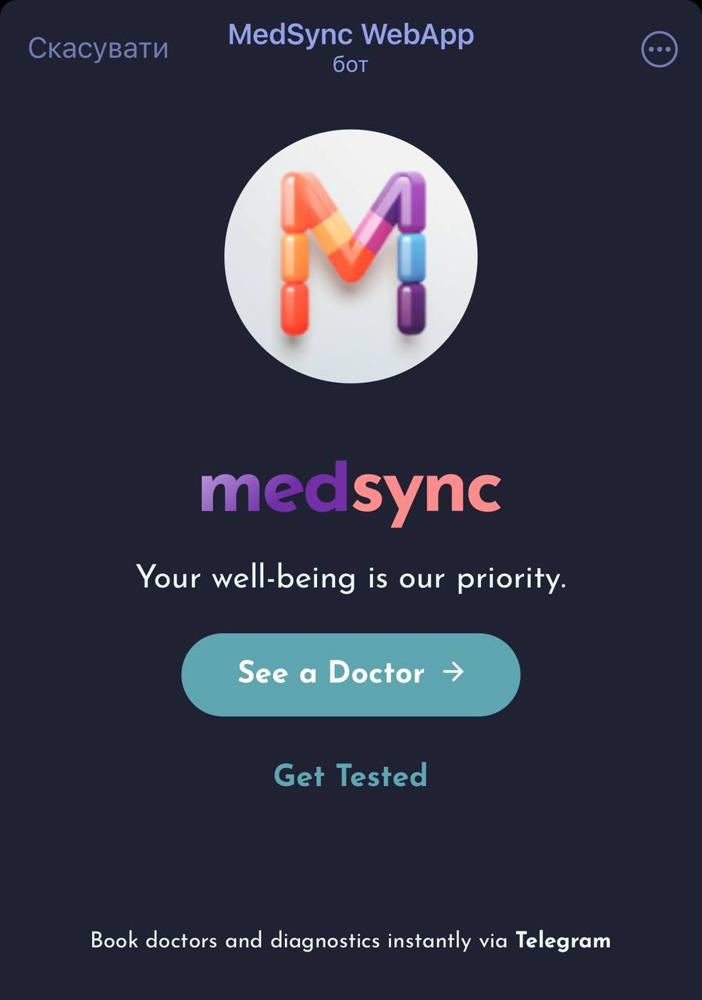
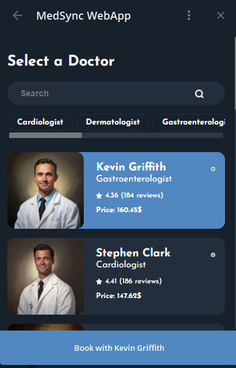
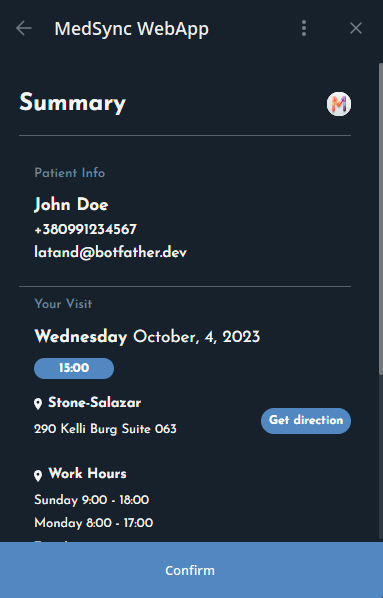
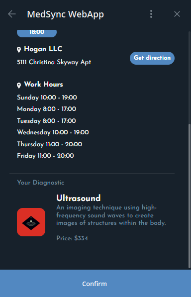
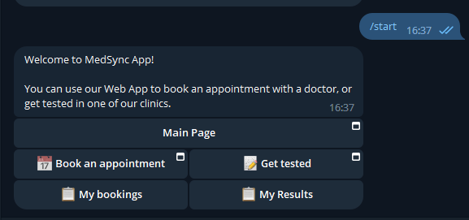
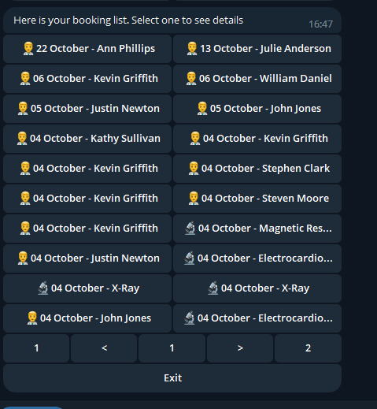
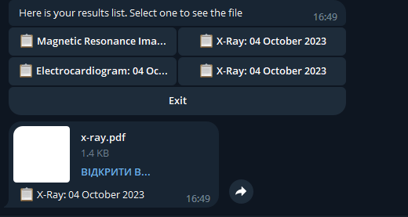

# WebApp UserFlow

## Home Screen

- To view the bot flow, please refer to the [Telegram Bot Flow](#telegram-bot-flow) section.
- Upon launching the MedSync app, users are presented with a home screen that gives them two primary options: consulting a
doctor or opting for medical tests.

!!! Tip
    **Interface Colors**: The WebApp interface adopts the color scheme from the user's Telegram theme, providing a
    cohesive and visually pleasing user experience.

## Doctor Selection

The app presents a list of available doctors, categorized by their specialties. Each doctor profile displays pertinent
details such as specialty, ratings, reviews, and consultation fees.

## Doctor Profiles

Tapping on a doctor's name leads the user to an individual profile page. This page elaborates on the doctor's experience
and expertise. There's also an option to book an appointment.

## Appointment Scheduling

Users can schedule an appointment by selecting a preferred date and time slot.

## Patient Information

To finalize the appointment, the user is required to input personal details, including name, contact information, and
any other relevant data.

## Booking Confirmation

Once the appointment is booked, a confirmation screen appears. There's also an option to book appointments with other
doctors.

## Diagnostic Tests

If users choose the 'Get Tested' option on the home screen, they'll be directed to a list of available diagnostic tests.
Each test is associated with specific clinics and pricing details.

## Clinic Selection

For each diagnostic test, users can select their preferred clinic based on location and other details.

---

## Clinic Slot and Patient Form
Upon choosing a clinic, users will be navigated to a time slot selection screen, similar to the doctor's appointment
flow. 

After picking the most suitable time, users will then be prompted to fill out the patient information form,
ensuring the clinic has all the necessary details for the upcoming test.

## Summary and Finalization
Once the patient information is captured, a summary of the selected diagnostic test, chosen clinic, and the scheduled
time will be displayed. 

This summary acts as a final checkpoint before confirming the booking. Users are encouraged to
verify all details and make any necessary adjustments before finalization.

---
## Telegram Bot Flow
!!! warning
    The bot's user interface and functionalities might undergo changes. Consequently, the images provided in this documentation might become outdated, and it's always recommended to refer to the bot for the most current interface and features.

Upon initiating the MedSync bot on Telegram, users are welcomed with a brief introduction to the "MedSync App." 

The bot presents users with five primary inline-buttons:

### 1. **Main Page** 
   - The landing page, accessible via the WebApp.
### 2. **Book an Appointment** 
   - Allows users to schedule a consultation with a doctor through the WebApp.
### 3. **Get Tested** 
   - Provides users the ability to schedule medical tests at affiliated clinics via the WebApp.
### 4. **My Bookings**
   - Upon selecting this feature, the doctors/diagnostics names are presented with a chronological list
   - The interface supports pagination, allowing users to navigate through their appointment history. 
   - An "Exit" option is also available, ensuring easy navigation back to the main menu.

### 5. **My Results**
   - Choosing "My Results" enables users to swiftly access a list of their diagnostic outcomes. 
   - Each entry provides details about the test type and its corresponding date. 
   - Further exploring presents the complete diagnostic report.

